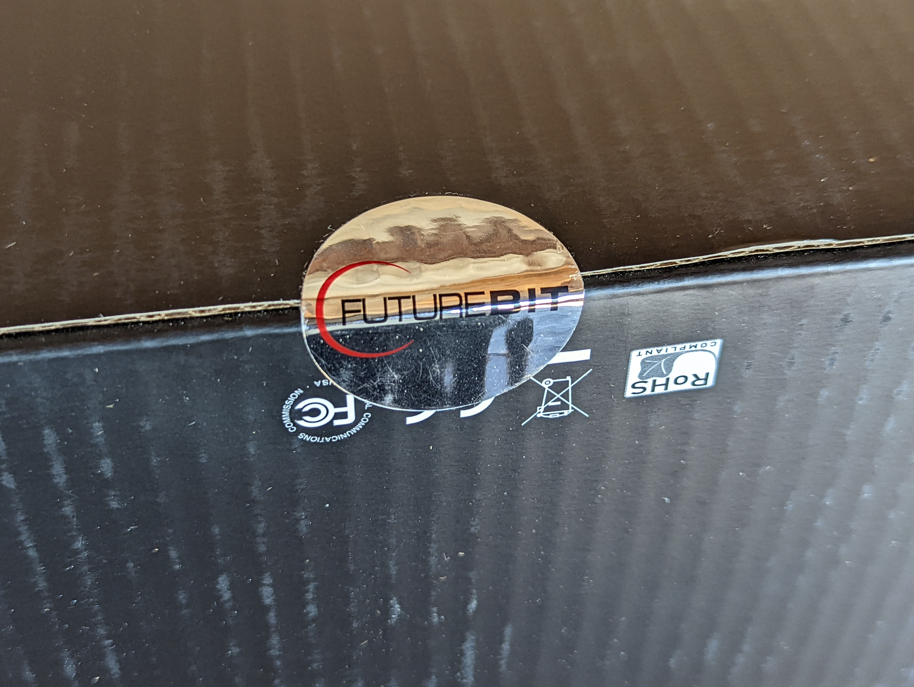
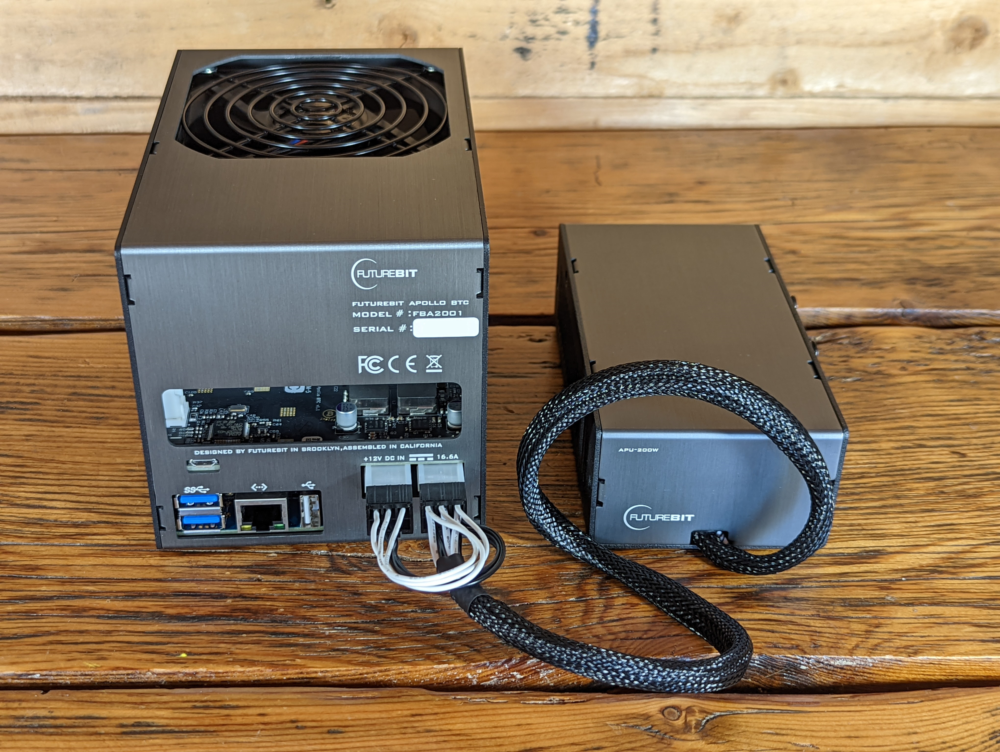

# Unboxing
The Apollo ships in an inconspicuous brown box measuring 10" x 8" x 5". There are no company stickers, logos, or designs on the box or any indications that there is Bitcoin related contents within. 

Inside the brown box is the FutureBit packaged box which is sealed shut with a foil sticker. Inside box is a foam-packed controller, power supply, power cable, and instruction card.

  
  
  
  
  

The Apollo is ready to plug in right out of the box. The enclosure is made of aluminium, there is a large cooling fan on the top, the heat sink can draw in air from three sides as well as the bottom as it is a open underside design. The bottom of the Apollo is also where you can confirm that the included 16GB microSD card is inserted all the way. If you ever want to upgrade the storage capacity beyond the included 1TB PCIe NVMe M.2 SSD, you can easily access it from the open bottom as well. 

  
  
  
  
   
  
   
  

  
The included power supply has two 6-pin firectional connectors that plug into the back of the Apollo. This will achieve ~3Th in hash rate. If you want to achieve the full ~3.8Th, then you need to get your own power supply that is rated for more than 300 Watts. If you want to connect your Apollo to a dedicated monitor, mouse, and keyboard then connect those devices now. For a wired internet connection, plug in an Ethernet cable to connect to your local network. Then simply connect the included power cable to the other side of the power supply and plug it into an outlet and you are ready to power on the Apollo.
 

  
  
  
  

There are additional connection types on the Apollo to suit a range of configuration options. You can connect a monitor to the HDMI out port and a USB keyboard/mouse to the USB ports. There is also a high speed USB-3 and USB-C port for optional peripherals. If you don't want to use an Ethernet cable, you can connect to your network with a modern dual band AC WiFi controller. Alternatively, there is a dedicated 1 Gigabit Ethernet port as well, which is how it was configured in this guide. You can also connect bluetooth devices as Bluetooth v5 comes built in, this includes the Bluetooth Ledger Hardware wallet. The Apollo also has an audio in/out port.

Once the Apollo powers on, the light indicator on the front will flash red & blue for a few minutes while the device goes through its initial configurations automatically. After a few minutes, the light will steadily flash red and the cooling fan will then start spinning, this indicates that the Apollo is now hashing and ready to configure.  

