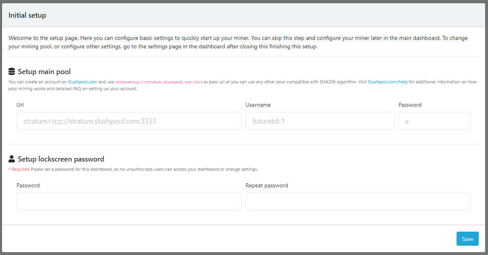
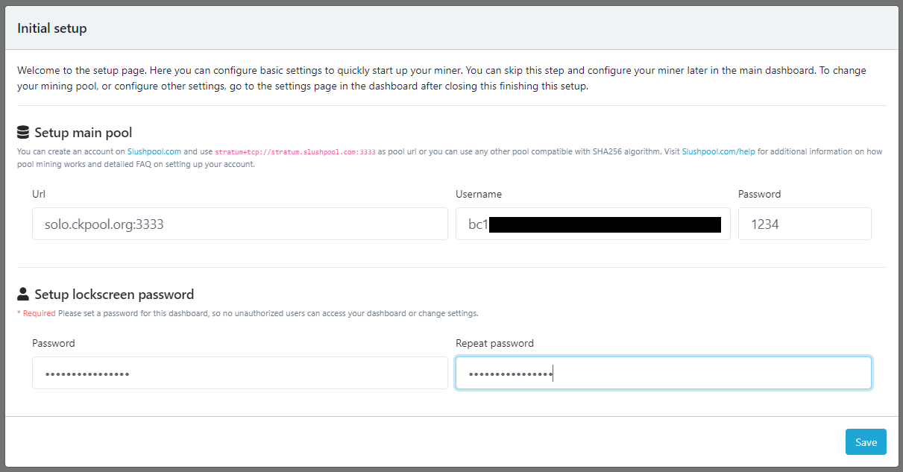

# Connecting to a Bitcoin Mining Pool
This section will show you how to connect to a Bitcoin mining pool. After the Apollo completed the automatic initial configuration, it started hashing. This is indicated by the steady flashing red light on the front of the device and the cooling fan running. More detailed instructions can be found on the [FutureBit Support Page](https://www.futurebit.io/apollo-btc-support).

If you connected a monitor, keyboard, and mouse to the Apollo then you should be greeted with a login screen after all the system level configurations are complete. The password should be `futurebit123`. The Apollo Operating System (OS) is built on a Linux distrobution called Armbian. You can complete the following steps in this section on the Apollo desktop environment if you want or you can also do this remotely from another computer on the same local network. However, the next section will cover connecting the Apollo to a desktop wallet on a remote computer and that will not be done on the Apollo's desktop environment. 

Otherwise, if you are running the Apollo remotely, then you need to find the local IP address on your network. The easiest way to do this is by logging into your router and checking the list of devices under the DHCP leases section. Your router should have a sticker with the local IP address needed to login along with the password. If not, the directions are usually pretty easy to find with an online search for your manufacturer's router. Typically, you can just type `192.168.0.1` or `192.168.1.1` or `10.0.0.1` into your web browser and that will bring you to your router login page. From there the username/password can vary depending on manufacturer but they are usually something like `admin/admin` or `admin/1234` or `admin/password`. Alternatively, programs like [AngryIP](https://angryip.org/) may be used to scan your network for all active IP addresses. You should be able to find the IP address for your Apollo next to the device named `futurebit-btc` in your DHCP leases list.

Once you have the local IP address for your Apollo, enter it into your favorite web browser on a computer connected to the same local network. You should be looking at a screen like the one below. This is asking you what mining pool you would like to join. You have many options when it comes to Bitcoin mining pools. You can check out a list of the top 15 Bitcoin mining pools by size on the [btc.com website](https://btc.com/).

[Slush Pool](https://slushpool.com/) is a great pool to get started with, they were the first Bitcoin mining pool, they supported small blockers during the [Block Wars](https://blog.bitmex.com/the-blocksize-war-chapter-1-first-strike/), they were the first pool to signal for Taproot activation, they have a user-friendly dashboard with detailed data points, their mobile app allows users to monitor hash rate while on the go, and they have a Pay Per Last N Shares (PPLNS) payout method. When blocks are found on Slush Pool, you get rewarded in proportion to your average shares.

Alternatively, [CK Pool](https://solo.ckpool.org/) is an option if you want to take a gamble and see if you can be the lucky miner who solves a block. With most Bitcoin mining pools, when a pool participant finds a block, all the miners in the pool get a piece of the rewards minus a percentage fee that goes to the pool operator. With solo CK Pool on the other hand, when a pool participant finds a block they get 98% of the entire block reward (subsidy + tx fees) and the pool gets 2%.

In this guide, CK Pool was used. The concepts presented here are mostly the same for other mining pools. Check out a few different pools to see which one is a good fit for you. 

- You want to take the mining pool URL and copy/paste it in the `URL` dialog box on the Apollo Initial Setup screen.
- Enter the `Username` in the next dialog box. If you're using Slush Pool, this will be the same username used for logging into your Slush Pool account. If you are using CK Pool, this will be the Bitcoin address you want the rewards deposited to if you solve for a block. In either case, you can append the username with `.worker1`, `.worker2`, etc to distinguish between multiple miners you may have. 
- The `Password` entered in the next dialog box has no security consequences, it is merely a method for controlling spam pings to the mining pool's server, this can be something as simple as `1234`.
- Below in the next two dialog boxes however, this password is sensitive in terms of security. This password is the one that will allow access to your Apollo dashboard. Using high entropy passwords is a good practice. 
- Once you are finished click on `Save` in the lower right-hand corner. 

Next, you should be brought to your Apollo lock-screen. Enter the password you created for accessing your Apollo dashboard. 

  
  

You should now be looking at your Apollo dashboard, congratulations, you're all finished!

On the left-hand side is a vertical menu, here you can click on `Miner` > `Dashboard` to see stats on your mining activity such as current hash rate, Wattage consumption, share rejection rate, uptime, temperature, fan speed, and more. 

This is a good time to check your mining pool dashboard to see if your hash rate is hitting the pool. If you are using CK Pool, the dash board is pretty simple with just the basic information printed. You can use the URL: https://solo.ckpool.org/users/YOUR-BITCOIN-ADDRESS to monitor your stats. 

  
  

Or if you are using Slush Pool, you'll have many more details and features in your dashboard. 

Once you see hash rate showing up in your mining pool dashboard, that's it, you are finished with your miner setup. You can `Start`, `Stop`, and `Restart` your miner from the left-hand side menu as well.  

Back in your Apollo dashboard, you can click on `Node` > `Dashboard` and then check the status of your full Bitcoin node. When the Apollo did its initial automatic configuration, one of the processes was starting up your Bitcoin node. You will see that it has already started downloading the entire Bitcoin blockchain all the way back to the very first block in January 2009. The initial blockchain download will take roughly two days. 52:20 in this demonstration. This process will just continue running in the background until it is finished. 

You can `Start` and `Stop` your node from the left-hand side menu as well. 

Leave the settings of the Apollo on `ECO` mode while it is completing the initial blockchain download. Once the Apollo is fully synchronized, then you can navigate to the `Settings` tab in the left-hand menu and there you can change the configuration to `Balanced` mode, which will run the Apollo making a good compromise between hashrate, efficiency, and noise. Running the Apollo in `Turbo` mode will be the least efficient, but its hashrate will be the highest. This mode is only recommended for expert users, and you should monitor your miner for possible overheating. The fan can get loud in this mode.

Otherwise, your Apollo is good to go at this point. You now have a full Bitcoin node and a miner running quietly. The next section will demonstrate how to connect the Apollo's node to a desktop Bitcoin wallet.
