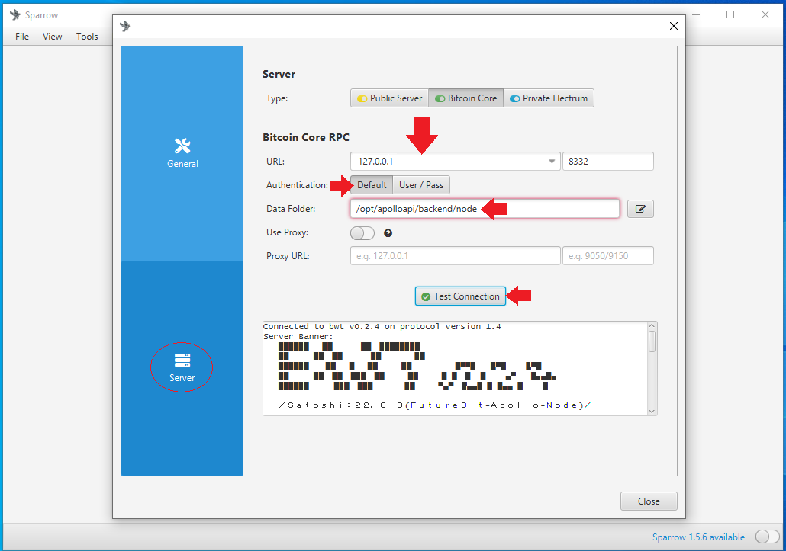
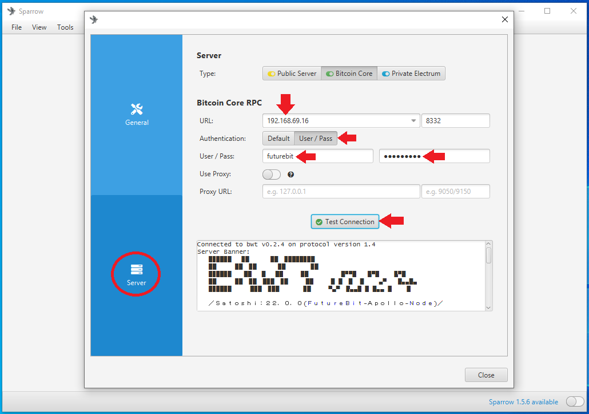
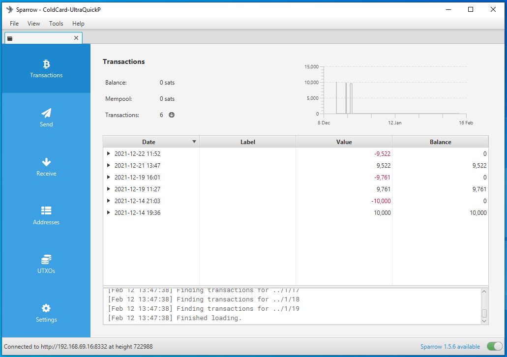

# Configuring Apollo as a Sparrow Wallet Backend
Sparrow Wallet is a Bitcoin wallet designed to be connected with your own node and ran from your desktop or laptop computer. This is a user-friendly wallet with an intuitive interface and many advanced features for a range of capabilities. To learn more about Sparrow Wallet and for installation instructions, visit the [Sparrow Wallet website](https://www.sparrowwallet.com/).

Since the Apollo is running Bitcoin Core, this can be used as a backend for Sparrow Wallet so that you gain the ability to broadcast transactions from your own node and verify your transactions against your own copy of the the Bitcoin blockchain. Otherwise, you would be reliant on trusting someone else's node, such as a public Electrum server.

You can install Sparrow Wallet directly onto the Apollo since it has a full desktop environment like any other personal computer. Because Apollo runs on a Linuz based operating system, you will want to download the Linux amd64 latest version of Sparrow Wallet from [here](https://www.sparrowwallet.com/download/). Just make sure you have your monitor, keyboard, and mouse connected then you can navigate through these steps from there. If you install Sparrow Wallet on the Apollo then you should not have to do any configuration in Bitcoin Core as it is set with the necessary command be default on the Apollo, `server=1`.  

Otherwise, if you have Sparrow Wallet installed on a different computer then you can still use the Apollo as a back end through Remote Procedure Calls (RPC). You just need to open up the `bitcoin.conf` file and make a couple changes. For this demonstration a SSH connection to the Apollo from a separate computer on the same local network will be used. 

## SSH Connection
To establish the SSH connection, a simple application called Putty can be used. Learn more about Putty [here](https://www.putty.org/) and download it from [here](https://www.chiark.greenend.org.uk/~sgtatham/putty/latest.html). Best practice is to verify the download, then run the `.msi` file and follow the install wizard prompts.

Once you run the Putty application, enter the local IP address of your Apollo in the `Host Name` dialog box, enter your user, which will be `futurebit`, the `@` symbol, followed by your Apollo local IP local address. For example, all together, it should look like: `futurebit@192.168.69.16` and then select `Open` at the bottom. You can also save these settings so you don't have to enter this information manually each time. 

  

You may see a warning like this, select `Yes` to add the key to Putty's cache.  

  

Next, you should be asked for the password, enter `futurebit123`.

Then you should be looking at a screen like this, *DO NOT RUN THE UPDATES*, doing that will brick your device and you'll have to reflash the factory image. This is a known issue and will be corrected in a future update, you can read more about it [here](https://bitcointalk.org/index.php?topic=5340015.msg57091053#msg57091053). 

  

All you need to do from this point is add the RPC settings to the Bitcoin configuration file. First, change the directory to the location of the configuration file by running this command: `cd /opt/apolloapi/backend/node`

And then this command will open that file in a text editor called "Nano": `sudo nano bitcoin.conf`

Once you have the configuration file open, add the following lines:

`rpcbind=127.0.0.1`

`rpcbind=192.168.69.16` (your Apollo local IP address)

`rpcallowip=127.0.0.1`

`rpcallowip=192.168.69.12` (your desktop local IP address)

  

Then hit `ctrl + x` to exit, `y` for yes, and `enter` to save. Now you can exit your SSH session by running the `exit` command. 

Back in the web dashboard, click on the `Reboot` button in the left-hand side menu. This will shutdown and restart the Apollo and the changes made to the `bitcoin.conf` file will be applied. 

  

## Sparrow Wallet
Now you are ready to configure Sparrow Wallet to talk to your Apollo Bitcoin Core instance. Once you have Sparrow Wallet installed and launched, you will be presented with an empty user interface. Navigate to `File` > `Preferences`.

  

Then click on the <kbd>Server</kbd> tab on the left-hand side. Click on the <kbd>Bitcoin Core</kbd> tab for the `Server Type`. 

Option 1) If running Sparrow Wallet on the Apollo, use the `127.0.0.1` rpcbind IP address with `8332` as the port and the default authentication option. Set the Data Folder directory to the same folder the `bitcoin.conf` file is being written. This should be the same directory that BitcoinCore writes the `.cookie` file that Sparrow Wallet needs to read. You should be able to find that file path in something like `/opt/apolloapi/backend/node` from the file explorer in your Apollo desktop environment.

  

Option 2) If running Sparrow Wallet on a different computer, enter the local IP address for the Apollo in the URL dialog box. Use the same User/Pass that was in the `bitcoin.conf` file, `futurebit/futurebit`. Test the network connection from Sparrow Wallet. If it’s good, you should see the green check mark next to <kbd>Test Connection</kbd> and some information populated in the dialog box below that. Then you can close that window.   

  

Privacy note: Unfortunately, Bitcoin Core stores your public keys and balances unencrypted on the computer it is running on. Although your bitcoin are not directly at risk of theft, if this computer is regularly connected to the internet, it is at risk to hackers - which has the potential to make you a target if your balance and geographic location are discovered. To learn more about Sparrow Wallet best practices, check out [this Sparrow Wallet resource](https://www.sparrowwallet.com/docs/best-practices.html). 

Once configured you can now use Sparrow Wallet as a hot wallet, for Whirlpool CoinJoins, for a watch-only wallet for an air-gapped hardware wallet, and more. All configured to use the Apollo as the backend node, keeping your transaction inquiries and broadcasts more private. 

  

## Conclusion
This guide has demonstrated unboxing, setting up, connecting, and configuring the FutureBit Apollo in such a way that it is remotely accessed on a home network, mining on solo CK Pool, and running the backend for a remotely accessible Bitcoin desktop wallet. There will be more developments in store for the Apollo so be sure to follow [@FutureBit](https://twitter.com/FutureBit) on Twitter for announcements and check out their [website](https://www.futurebit.io/) to order an Apollo for yourself.  
