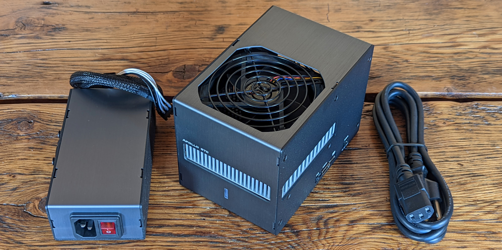

# FutureBit - Apollo
A guide for getting started with the [FutureBit](https://www.futurebit.io/) Apollo Bitcoin node & miner. The Apollo is a full archival Bitcoin node, currently running Bitcoin Core v22.0.0. Additionally, the Apollo is a Bitcoin miner equipped with 44 ASIC chips capable of producing nearly 3 Terra Hash (Th). The Apollo is built on a revamped platform featuring a 6-core CPU, 4GB of RAM, and a 1TB SSD. The Apollo can go from delivery to hashing at a pool of your choice in less than 15-minutes and it can sync the entire Bitcoin blockchain in 2-days. 

The Apollo brings the full Bitcoin ecosystem back into one device. The wallet, the node, and the minier are all contained in one cohesive device that anybody can run quietly on their desk. As the technology in Bitcoin has advanced over the years there has been a fragmentation from the way users interacted with the Bitcoin software; dedicated wallet, node, & mining companies/projects have evolved from what was once all running in an application on a personal computer. 

As large mining pools draw in more hash rate, the Bitcoin network becomes more centralized and escaping regulatory capture becomes more difficult. Not everyone can or will want to run industrial-grade miners in their home. The +80 dB noise levels and the +150° F temperatures can be difficult to manage. Although there are a great many resources available for DIY enthusiasts interested in joining the Bitcoin home mining renaissance, the Apollo is designed with a more broad user base in mind. The Apollo runs quietly at ~20dB, takes about 15 minutes to install and connect to a pool, and the user interface makes interacting with it user friendly. 

To hear it straight from the source, check out this guest segment from [The Hash Cast](https://bitcointv.com/w/f33d38Y2a3833mySFhLpz9?start=7m44s) with FutureBit founder, [John Stefanopoulos](https://twitter.com/JStefanop1), on BitcoinTV talking about solo mining block finds and decentralizing hash power. 

This guide will show you how to get started with a FutureBit Apollo Full Package model. Topics covered here are:

- Unboxing & Setup
- Connecting to a Bitcoin mining pool
- Configuring the Bitcoin node with [Sparrow Wallet](https://www.sparrowwallet.com/)

## Technical Specifications of the Apollo
- Size: 4” x 6” x 4”
- Hashboard: SHA256 Mining Performance from 2TH/s to 3TH/s stock, up to 3.8 TH/s achievable with an external >300 Watt power supply  
- Power: 125 watts in ECO mode to 200 watts in TURBO mode
- Fan: 1k - 5k RPM low noise Dual Ball bearing fan (under 25 dBa in ECO mode)
- Connectors: Audio in/out, HDMI out, USB Type C, 5v out DC, two USB 3.0, Gigabit Ethernet, and USB 2.0 on the full package version
- Power Connectors: Two Six Pin 12v PCIe power connectors
- Power Supply: 90-240v AC input @ 1.8 A,  12v output @ 16.7 A (MAX 200W)
